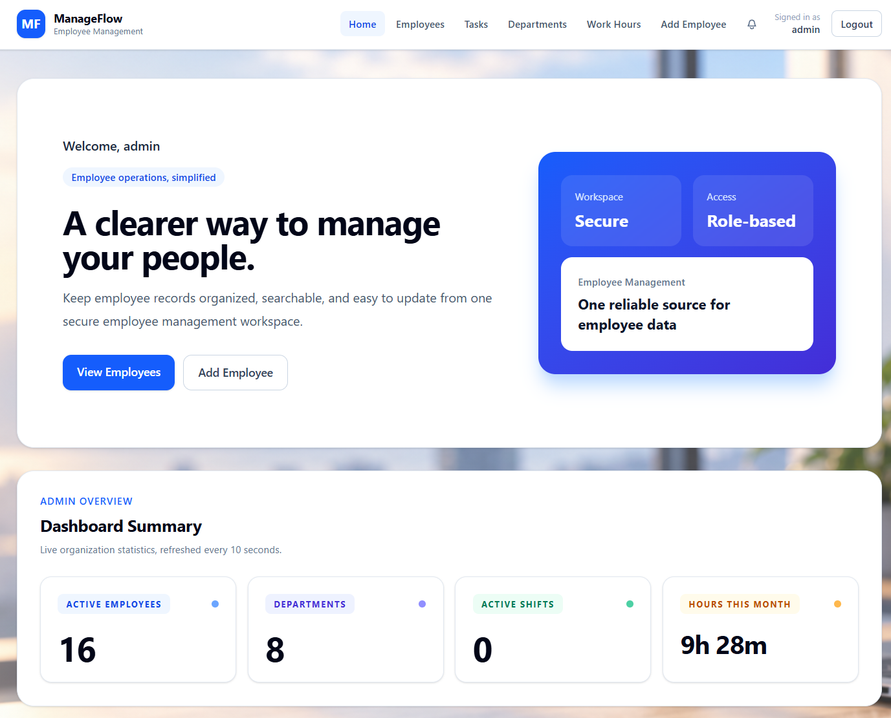
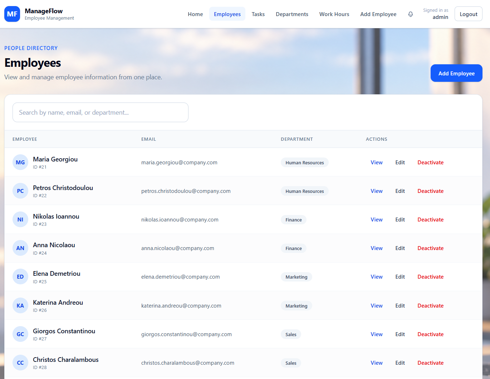
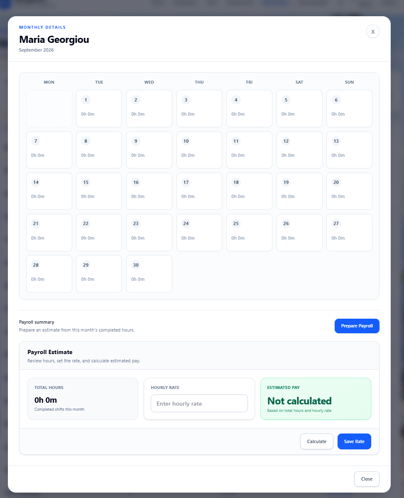
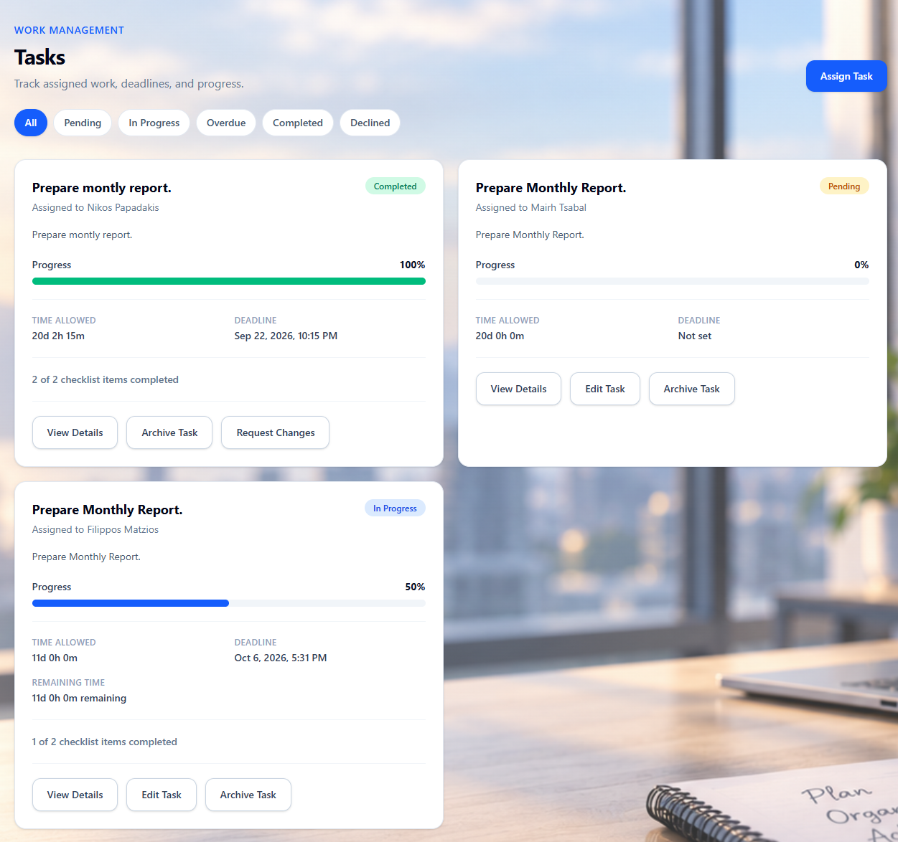
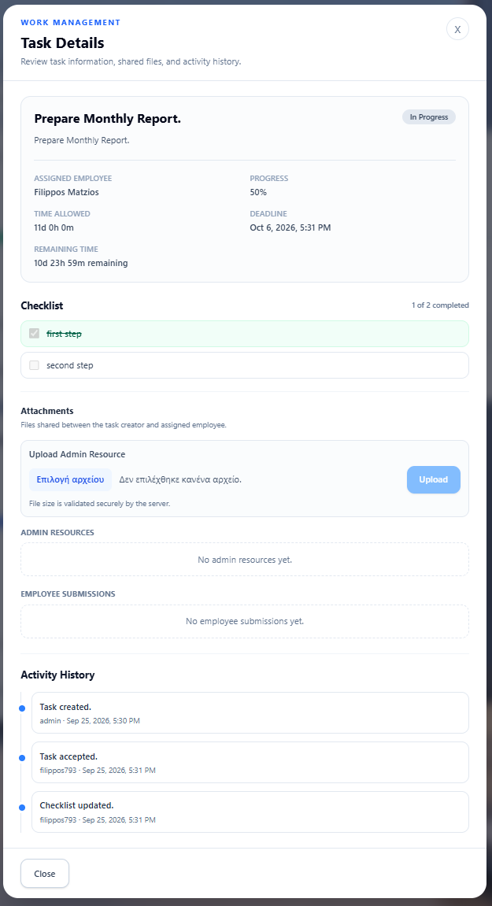
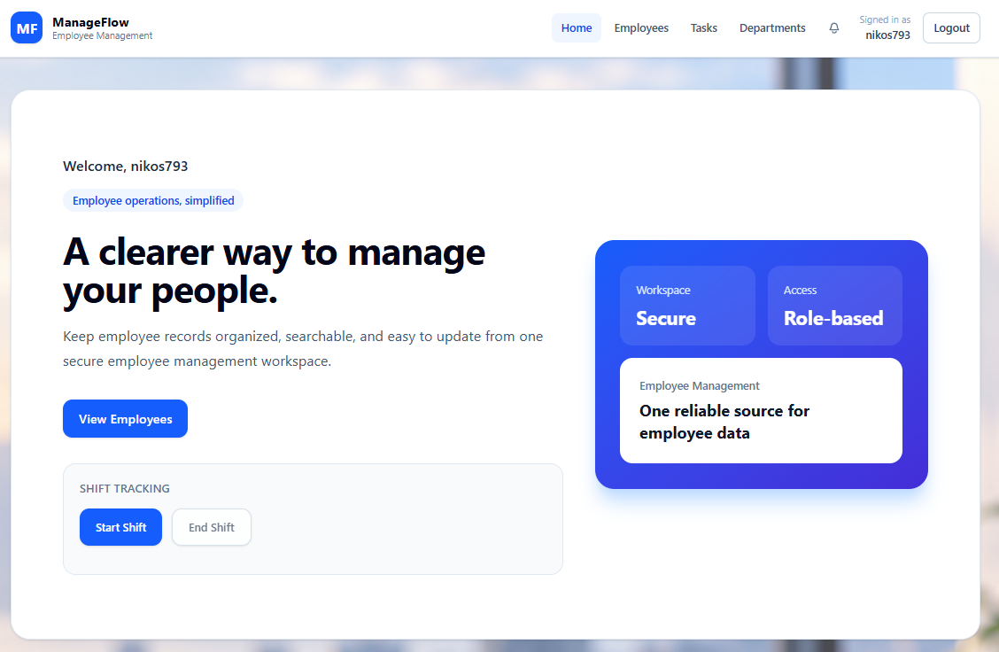

# ManageFlow

ManageFlow is Full-stack employee management and task collaboration application. It provides secure employee and department management, work-shift tracking, monthly work-hours reporting, task collaboration, account onboarding, and role-based access for administrators and employees.

The project is designed as a portfolio application that demonstrates a practical Spring Boot, PostgreSQL, and React architecture.

## Main Features

- Secure JWT login with `ADMIN` and `EMPLOYEE` roles.
- Employee lifecycle management: create, edit, deactivate, and reactivate employees while preserving historical records.
- Department CRUD with normalized, case-insensitive department names.
- Public registration requests that require administrator approval before an account is created.
- Employee invitation flow: an administrator can invite an employee to choose a username and password through a time-limited, one-time link.
- Email notifications for registration approval, invitations, and account reactivation.
- Work-shift clock-in / clock-out, active-shift protection, and timezone-safe timestamps.
- Monthly work-hours reports, employee daily details, hourly-rate storage, and payroll preparation in the UI.
- Administrator dashboard statistics for active employees, departments, active shifts, and completed hours this month.
- Task management with assignment, acceptance/decline, deadlines, checklist-driven or manual progress, attachments, activity history, change requests, and archiving.
- Persistent in-app notifications for task assignment, updates, acceptance, decline, completion, and requested changes.

## Screenshots

### Admin Dashboard

Overview cards for active employees, departments, active shifts, and this month's completed hours.



### Employee Directory

Central employee directory with role-aware management actions and department information.



### Work Hours and Payroll Preparation

Monthly work calendar with completed time, saved hourly rate, and estimated-pay calculation.



### Task Management

Task workspace with status, progress, deadlines, filters, and role-specific actions.



### Task Details and Collaboration

Detailed task view with checklist progress, shared attachments, and activity history.



### Employee Workspace

Employee view for shift tracking, assigned work, and in-app notifications.



## Roles

### ADMIN

Administrators can manage employees and departments, approve or reject registration requests, manage employee invitations, view work-hours reports and dashboard statistics, assign and manage their own tasks, review submissions, and archive tasks.

### EMPLOYEE

Employees have read-only access to employee and department information, can manage their own work shifts, see their own assigned tasks, accept or decline pending tasks, update permitted task progress/checklists, upload submissions for active tasks, and read their own notifications.

The backend always enforces authorization and ownership rules. The frontend only mirrors these rules for usability.

## Employee Onboarding

ManageFlow supports two controlled onboarding paths:

1. **Registration request**: a visitor submits a request. An administrator reviews it, assigns a department, and approves or rejects it. Approval creates the Employee and linked EMPLOYEE User account.
2. **Employee invitation**: an administrator creates an employee and sends a one-time invitation. The employee opens the link and sets their own username and password.

Registration approval and invitation emails are sent after the relevant database transaction has committed. Email delivery failure does not roll back the employee/account action.

## Task Management

Tasks are created by an ADMIN and assigned to an active Employee with a linked EMPLOYEE account. A task can include an optional checklist.

- `PENDING` tasks can be accepted or declined by the assigned employee.
- Acceptance records the server time and calculates a deadline from the allowed duration.
- Checklist tasks calculate progress automatically from completed items.
- Tasks without a checklist keep the manual progress flow; reaching 100% completes the task.
- Administrators can edit eligible tasks, request changes on completed tasks, and archive tasks they created.
- Admin resources and employee submissions are stored as filesystem files with database metadata, validation, ownership checks, and download authorization.
- Activity history records the main lifecycle transitions.

## Technology Stack

### Backend

- Java 21
- Spring Boot 4.1
- Spring Web, Spring Security, Spring Data JPA
- JWT authentication
- Hibernate / JPA
- PostgreSQL
- Flyway migrations
- Spring Mail / JavaMailSender for SMTP email
- Springdoc OpenAPI / Swagger UI
- JUnit 5, Mockito, and Spring MVC test support

### Frontend

- React 19
- React Router
- Vite
- Tailwind CSS
- Vitest and React Testing Library
- ESLint

## Architecture

### Backend

The backend follows a layered structure:

```text
controller -> service -> repository -> PostgreSQL
                 |
              mapper / DTOs
```

- Controllers expose REST endpoints and validate requests.
- Services hold business rules, transactions, authorization ownership checks, and domain workflows.
- Repositories use Spring Data JPA.
- Request/response DTOs prevent JPA entities and password hashes from being returned directly.
- Mappers convert between entities and DTOs.
- Central exception/security handlers return a consistent JSON API error format.

### Frontend

The React application uses page components, reusable UI components, API services, protected routes, and role-aware UI. JWT data is stored locally after login; the API service pattern sends the bearer token for protected requests and handles expired/invalid sessions centrally.

## Database Design

PostgreSQL is used as the relational database. Flyway manages schema changes from `V1` onward; Hibernate runs with `ddl-auto=validate`.

Important relationships include:

- Department `1 -> N` Employees
- Employee `0..1 -> 1` User account
- Employee `1 -> N` WorkShifts
- Employee `1 -> N` assigned Tasks
- User `1 -> N` created Tasks, notifications, uploaded attachments, and task activities
- Task `1 -> N` checklist items, attachments, activities, and notifications

Employee deactivation preserves work-shift, payroll, and task history. Deactivation is blocked when an employee has an open shift or active non-archived task.

## Security

- JWT Bearer authentication with Spring Security.
- BCrypt password hashing.
- Role-based endpoint authorization.
- Employee ownership checks for work shifts, tasks, notifications, and attachments.
- Case-insensitive uniqueness constraints for usernames and employee emails.
- One-time invitation tokens are stored as hashes and expire after 48 hours.
- File upload validation protects against unsafe filenames/path traversal and applies configured size limits.

## Prerequisites

- Java 21
- PostgreSQL running locally
- Node.js and npm
- A Gmail SMTP account/app password only if you want to test outbound emails locally

The backend Maven Wrapper is included, so a global Maven installation is not required.

## Local Setup

### 1. Create the PostgreSQL database

Create the local database used by the `dev` profile:

```sql
CREATE DATABASE employee_management;
```

The first application startup runs Flyway automatically. Do not create tables manually.

### 2. Configure backend environment variables

From the project root, copy the provided example:

```bat
copy dev.env.bat.example dev.env.bat
```

Edit the ignored `dev.env.bat` with local values. Never commit it.

Required for a fresh local database:

| Variable | Purpose |
| --- | --- |
| `DB_PASSWORD` | Local PostgreSQL password for the dev profile. |
| `JWT_SECRET` | Base64-encoded JWT signing secret. |
| `ADMIN_USERNAME` | Initial administrator username. |
| `ADMIN_PASSWORD` | Initial administrator password. Stored as BCrypt. |

Email configuration for local invitation/approval emails:

| Variable | Purpose |
| --- | --- |
| `MAIL_HOST` | SMTP host. |
| `MAIL_PORT` | SMTP port. |
| `MAIL_USERNAME` | SMTP username/email. |
| `MAIL_PASSWORD` | SMTP password or Gmail App Password. |

Other documented configuration:

| Variable | Purpose |
| --- | --- |
| `DB_URL` / `DB_USERNAME` | Datasource URL and username used by the production profile. |
| `FRONTEND_ORIGIN` | Allowed frontend origin in the production profile. |
| `FRONTEND_BASE_URL` | Base URL used in employee invitation links. |
| `BUSINESS_TIME_ZONE` | Business timezone; defaults to `Europe/Athens`. |
| `TASK_ATTACHMENT_STORAGE_PATH` | Optional attachment storage directory. Defaults to `uploads/task-attachments`. |
| `TASK_ATTACHMENT_MAX_FILE_SIZE_BYTES` | Optional metadata-level maximum attachment size. Defaults to 10 MB. |
| `TASK_ATTACHMENT_MAX_FILE_SIZE` / `TASK_ATTACHMENT_MAX_REQUEST_SIZE` | Optional Spring multipart limits. Default to 10 MB. |

`DB_PASSWORD` and `JWT_SECRET` are required for every backend start. `ADMIN_USERNAME` and `ADMIN_PASSWORD` are required only when the database has no ADMIN yet; the application fails safely if they are missing at that point. Replace all example placeholders before the first startup.

`application-dev.properties` uses local PostgreSQL defaults and `application-prod.properties` reads production datasource/CORS values from environment variables. For a new database, the bootstrap creates exactly one ADMIN; later restarts do not create another.

### 3. Install frontend dependencies

```bat
cd employee-management-frontend
npm install
cd ..
```

### 4. Configure the frontend

Create the frontend environment file from the example:

```bat
cd employee-management-frontend
copy .env.example .env
```

The frontend requires:

```env
VITE_API_URL=http://localhost:8080
```

### 5. Start the application

From the project root on Windows:

```bat
start-dev.bat
```

The script loads `dev.env.bat`, validates the required backend variables, starts the backend with the `dev` profile, and starts the Vite frontend in a separate terminal.

Alternatively, start each application manually after loading the required environment variables:

```bat
cd employee-management-backend
mvnw.cmd spring-boot:run
```

```bat
cd employee-management-frontend
npm install
npm run dev
```

Default local URLs:

- Frontend: `http://localhost:5173`
- Backend: `http://localhost:8080`
- Swagger UI: `http://localhost:8080/swagger-ui/index.html`
- OpenAPI JSON: `http://localhost:8080/v3/api-docs`

In Swagger UI, use **Authorize** and paste a JWT as a Bearer token after logging in.

## Tests and Quality Checks

### Backend

```bat
cd employee-management-backend
mvnw.cmd test
mvnw.cmd clean package
```

The backend suite covers service behavior, validation, controllers, authorization/security behavior, Flyway-sensitive flows, and task lifecycle logic. It uses unit and Spring MVC-style tests; it is not presented as a Testcontainers or real-PostgreSQL integration suite.

### Frontend

```bat
cd employee-management-frontend
npm install
npm test
npm run lint
npm run build
```

## Configuration and Repository Safety

- `dev.env.bat`, frontend `.env`, `JWT_SECRET_password.txt`, attachment uploads, build output, logs, and IDE files are ignored by Git.
- Keep real database passwords, JWT secrets, Gmail credentials, App Passwords, and bootstrap ADMIN credentials only in local or deployment environment variables.
- `dev.env.bat.example` and `.env.example` contain placeholders only.
- Task attachment binaries are not stored in PostgreSQL. The database stores attachment metadata and a safe filesystem reference; local files default to `employee-management-backend/uploads/task-attachments/` and must remain out of Git.
- The production profile expects database, JWT, CORS, mail, and initial-admin configuration through environment variables.

## API Documentation

Swagger/OpenAPI documents authentication, employees, departments, work shifts, dashboard/reporting, registration requests, invitations, tasks, attachments, activities, and notifications.

Open Swagger UI locally at:

```text
http://localhost:8080/swagger-ui/index.html
```
